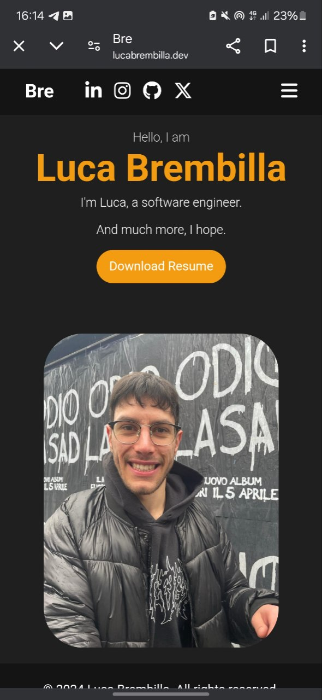

# Personal Website Project

## 🌐 Overview

Welcome to the repository for my [personal website](https://lucabrembilla.dev)! This website serves as a platform where I share insights about my projects, personal interests, and everyday life. It's built using **React** for the frontend, hosted on **Firebase**, and DNS management is handled through **Cloudflare** to ensure speed and security.

## 🚀 Features

- **Responsive Design**: Optimized for viewing on all devices, from desktops to mobile.
- **Interactive UI**: Built with React, leveraging reusable components for a dynamic user experience.
- **Fast & Secure Hosting**: Deployed on Firebase with automatic SSL certificates, ensuring a secure and fast connection.


## 📸 Screenshots

| Home Page                                      |
|------------------------------------------------|
|               |

## 🛠️ Tech Stack

- **Frontend**: React – A powerful JavaScript library for building user interfaces.
- **Hosting**: Firebase – Google’s platform for fast and scalable web hosting.
- **DNS Management**: Cloudflare – Provides DNS security, speed, and performance enhancements.
- **Version Control**: Git and GitHub for collaboration and version tracking.

## 🔧 Installation

If you'd like to run this project locally, follow these steps:

1. Clone the repository:
   ```bash
   git clone https://github.com/your-username/personal-website.git
   ```

2. Navigate to the project directory:
   ```bash
   cd personal-website
   ```

3. Install dependencies:
   ```bash
   npm install
   ```

4. Start the development server:
   ```bash
   npm start
   ```

Your local development server should now be running at `http://localhost:3000`.

## 🚀 Deployment

This project is deployed using Firebase Hosting. To deploy it yourself, follow these steps:

1. Install the Firebase CLI:
   ```bash
   npm install -g firebase-tools
   ```

2. Login to Firebase:
   ```bash
   firebase login
   ```
   
3. Initialize Firebase in the project directory:
   ```bash
   firebase init
   ```

4. Deploy to Firebase:
   ```bash
   firebase deploy
   ```

## 📦 Project Structure
```
personal-website/
├── public/            # Static assets
├── src/
│   ├── components/    # React components
│   ├── pages/         # Website pages
│   └── App.js         # Main React app
├── .firebaserc        # Firebase config
├── .gitignore
├── firebase.json      # Firebase deployment config
├── package.json
└── README.md          # Website readme
```

## 📄 License

This project is licensed under the MIT License. See the LICENSE file for more details.

## 📝 Contact

Feel free to reach out to me with any questions or feedback!

[](mailto:lucabrembillaa@gmail.com)
